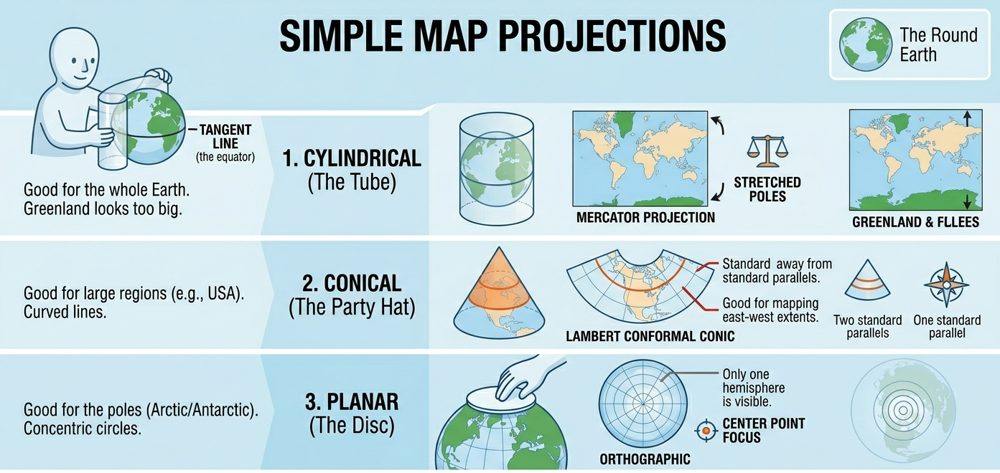

```{r setup, include=FALSE}
knitr::opts_chunk$set(echo = FALSE, message = FALSE, warning = FALSE)

make_color_bins <- function(x, n = 6, palette = "RdYlGn") {
  x <- as.numeric(x)
  if (length(x) == 0 || all(is.na(x))) {
    return(list(
      breaks = c(0, 1),
      bins = factor(rep("[NA]", length(x))),
      palette = "grey70",
      colors = rep("grey70", length(x)),
      legend = "[NA]"
    ))
  }

  breaks <- pretty(range(x, na.rm = TRUE), n = n)
  if (length(unique(breaks)) < 2) {
    center <- unique(x[!is.na(x)])[1]
    breaks <- c(center - 0.5, center + 0.5)
  }

  bins <- cut(x, breaks = breaks, include.lowest = TRUE)
  pal <- colorRampPalette(RColorBrewer::brewer.pal(11, palette))(length(levels(bins)))
  colors <- pal[as.integer(bins)]
  colors[is.na(colors)] <- "grey70"

  list(
    breaks = breaks,
    bins = bins,
    palette = pal,
    colors = colors,
    legend = levels(bins)
  )
}

plot_base_map <- function(world, bbox = NULL, bg_col = "grey95", border_col = "grey80") {
  if (is.null(bbox)) {
    bbox <- st_bbox(world)
  }
  plot(st_geometry(world), col = bg_col, border = border_col, reset = FALSE, extent = bbox)
}

align_crs <- function(x, target) {
  if (st_crs(x) != st_crs(target)) {
    x <- st_transform(x, st_crs(target))
  }
  x
}
```

# Introduction

Up to this point, most of our questions have been about how much. How
much yield changes with rainfall. How much disease severity changes with
treatment. How much biomass changes with nitrogen.

This module adds a question that shows up everywhere in agronomy:

> Where?

Where in the field are the low-testing areas? Where do soils change?
Where do yields drop off? Where should a recommendation change across
the landscape instead of staying constant?

In spatial data, observations are often not independent. Values that are
close together tend to be more similar than values far apart. This idea
is called spatial dependence, and it is the reason maps and
interpolation work at all.

That is what spatial statistics is really about. It is not just about
making pretty maps. It is about making sure location is treated as part
of the data-generating process.

And, as usual, the flashy part is rarely the hard part. The hard part is
making sure the geometry, units, and scale all make sense before you
start interpreting patterns.

So in this lecture we are going to work through three ideas that show up
again and again in real agronomic work:

-   **Projection and coordinate systems**: how spatial data locate
    objects on the earth
-   **Vector data and shapefiles**: points, lines, and polygons that
    represent things like yield points and field boundaries
-   **Rasters and interpolation**: grids of predicted values used to
    summarize spatial trends and build management maps

The goal is not for you to memorize every spatial package in R. The goal
is for you to become hard to fool. If a map looks impressive but the
coordinate system is wrong, I want you to notice. If two layers do not
line up, I want you to ask why. If someone hands you a variable-rate
map, I want you to understand the basic logic behind how that map was
produced.

# Part 1: Projection and Coordinate Systems

## Why Projection Matters

Projection is the part of spatial analysis that most people try to
ignore until it breaks something.

Here is the underlying problem: the earth is not flat, but our maps are.

So any time we put locations from the earth onto a flat display or into
a flat analysis system, we have to decide how that translation will
happen. That translation is what a projection does.

A coordinate reference system (CRS) includes the coordinate system and,
if needed, the projection used to flatten the Earth.



Every projection is a compromise. Some preserve shape better. Some
preserve area better. Some are better for measuring local distances.
Some are mainly convenient because mapping software uses them by
default.

For example, if you are comparing the total area of management zones
across a field or region, using a non-equal-area projection can bias
those calculations.

At field scale, several projections may look similar to your eye. That
is exactly why this can be dangerous. A map can look fine and still be
the wrong system for calculating area, joining layers, or measuring
distance.

So here is the habit I want us to build:

> Before trusting any map, check the coordinate reference system.

That one habit will save you a surprising amount of pain.

Before doing anything spatial, use this quick checklist:

-   What is the CRS?
-   What is the geometry type?
-   What are the units?
-   What is the grain (point, polygon, or raster)?

## WGS 84: The Familiar One

The most familiar system is **WGS 84**, identified by EPSG 4326.

This is the latitude-longitude system most of us recognize from GPS
coordinates. It uses angular units, not distance units. So when you see
values like $-93.2$ and $44.9$, you are looking at longitude and
latitude in degrees.

A key consequence of this is that you cannot treat differences in
longitude and latitude as simple distance changes. A one-degree change
in longitude does not correspond to the same distance everywhere on
Earth. It shrinks as you move toward the poles.

WGS 84 is excellent for storing locations and for displaying points on
the globe. It is often the first system you encounter when working with
field boundaries, sampling points, or online map data.

In practice, distance calculations in WGS84 require geodesic methods;
for most workflows, it is simpler and safer to transform to a projected
CRS.

```{r}
library(sf)

# US state boundaries are the base polygons for projection examples.
usa <- st_read(
  "raw-data/cb_2018_us_state_20m/cb_2018_us_state_20m.shp",
  quiet = TRUE
)

usa <- usa[!usa$STUSPS %in% c("AK", "HI", "PR"), "NAME"]
names(usa)[names(usa) == "NAME"] <- "state_name"

usa_4326 <- st_transform(usa, 4326)

plot(usa_4326, main = '')
```

This is the version of the United States that most people have in their
head. But notice the key point: those coordinates are in **degrees**,
not meters. Let's take a look at the first few rows of the data frame to
check the coordinates.

Coordinates are meaningless unless you know the CRS attached to them.

```{r}
head(usa_4326)
```

Let us isolate Iowa and look at its border points.

```{r}
world <- st_read('./raw-data/world/world.shp', quiet = TRUE)
world_4326 <- st_transform(world, 4326)

ia_4326 <- usa_4326[usa_4326$state_name == "Iowa", ]
ia_4326 <- st_cast(ia_4326, "POINT")

origin_4326 <- data.frame(x = 0, y = 0, id = 1)
origin_4326 <- st_as_sf(origin_4326, coords = c("x", "y"))
origin_4326 <- st_set_crs(origin_4326, 4326)


plot(st_geometry(world_4326), reset = FALSE)
plot(st_geometry(ia_4326), add = TRUE, col = "darkgreen", pch = 20, cex = 0.2 )
plot(st_geometry(origin_4326), add = TRUE, col = "red", pch = 20, cex = 2)
```

If we check the coordinates of the first few rows, you will see the
coordinates are longitudes and latitudes. For the Upper Midwest,
longitude is negative and latitude is positive because we are west of
the Prime Meridian and north of the Equator.

```{r}
head(ia_4326)
```

That is fine for locating things. It is not ideal for all measurements.

## Web Mercator: Convenient, Not Sacred

Another common system is **Web Mercator**, identified by EPSG 3857.

This is widely used by web maps. It is convenient. It is familiar. It is
also not magical. It is just one projection among many.

```{r}
usa_3857 <- st_transform(usa, 3857)

plot(usa_3857, main = '')
```

Now the coordinates are no longer in degrees. They are expressed in
projected units, often meters (but always check).

```{r}
ia_3857 <- usa_3857[usa_3857$state_name == "Iowa", ]
ia_3857 <- st_cast(ia_3857, "POINT")

head(ia_3857)
```

This projection is useful because many mapping tools expect it. But if
your job is to compute area accurately, or to perform field-scale
analysis, do not assume the default web map system is the best
analytical choice.

A useful rule of thumb:

-   Some coordinate systems are mainly for display.
-   Others are better suited for analysis.

Web Mercator is excellent for visualization but often a poor choice for
measurement.

## Equal-Area Projections: Better for Area Questions

If the question is about **area**, then an equal-area projection is
often the better choice.

Here is the U.S. National Atlas Equal Area system, EPSG 2163.

```{r}
usa_2163 <- st_transform(usa, 2163)

plot(usa_2163, main = '')
```

The map looks a little different because the distortion has been
redistributed. That is the point. We are trading off shape so that area
is represented more faithfully.

```{r}
ia_2163 <- usa_2163[usa_2163$state_name == "Iowa", ]
ia_2163 <- st_cast(ia_2163, "POINT")

head(ia_2163)
```

Notice that the numbers changed again. Same state. Same border.
Different coordinate system. That is why coordinates are meaningless
unless you know the CRS attached to them.

## UTM: Often Useful for Local Work

For local and regional work, a projected UTM system is often a sensible
choice because it uses distance-based units and behaves well over a more
limited geographic area.

UTM divides the Earth into zones, each with its own local projection.
That helps reduce distortion within a zone.

The main idea is not that you memorize zone numbers. The main idea is
that local projected systems are often more appropriate for field-scale
operations than latitude-longitude coordinates.

A simple rule is to use the UTM zone that covers your study area, or use
software defaults when transforming to UTM.

```{r}
usa_32615 <- st_transform(usa, 32615)
plot(usa_32615, main = '')
```

```{r}
head(usa_32615)
```

And here again are Iowa border coordinates in that projected system.

```{r}
ia_32615 <- usa_32615[usa_32615$state_name == "Iowa", ]
ia_32615 <- st_cast(ia_32615, "POINT")

head(ia_32615)
```

## Projection Summary

Here is the practical version of all of that:

-   WGS 84 is common for storing locations and GPS-style coordinates
-   Web Mercator is common for web maps
-   Equal-area systems are better when area is central to the question
-   Local projected systems are often better for measuring distance or
    doing field-scale spatial operations

If you remember only one thing from this section, remember this:

> Two layers that look like maps are not ready to analyze together until
> their coordinate systems are compatible.

One of the easiest ways to see why this matters is to look at the same
data in two different projections side by side.

Below, the left panel shows the contiguous United States in WGS84 (EPSG
4326). This is the geographic coordinate system, latitude and longitude
as plain degrees. I also drew a regular red grid on top of the map. In
WGS84, that grid looks like a simple set of square cells.

The right panel shows the exact same data reprojected to the US National
Atlas Equal Area system (EPSG 2163). The state boundaries still describe
the same country, but the red grid now bends and stretches. That is the
key visual idea: when you change projections, you are changing how the
curved Earth is laid onto a flat map.

Neither version is wrong. They describe the same Earth. But they make
different trade-offs, and they cannot be analyzed together without first
choosing one and transforming both layers to it.

```{r}
excl         <- c("Alaska", "Hawaii", "Puerto Rico")
usa_cont     <- usa_4326[!usa_4326$state_name %in% excl, ]
usa_grid <- st_make_grid(usa_cont)
usa_cont_2163 <- st_transform(usa_cont, 2163)
usa_grid_2163 <- st_transform(usa_grid, 2163)

par(mfrow = c(1, 2), mar = c(1, 1, 2, 1))

plot(st_geometry(usa_cont), col = "grey90", border = "grey40", 
     reset = FALSE)
plot(usa_grid, border = 'red', add = TRUE, lwd = 0.5, lty = 2)
title("WGS84 (EPSG 4326)", cex.main = 0.9)

plot(st_geometry(usa_cont_2163), col = "grey90", border = "grey40")
plot(usa_grid_2163, border = 'red', add = TRUE, lwd = 0.5, lty = 2)
title("Equal Area (EPSG 2163)", cex.main = 0.9)

par(mfrow = c(1, 1))
```

# Part 2: Vector Data and Shapefiles

## Case Study: A Yield Map

Now let us move from general map concepts into an actual agronomic
example.

We will start with a yield map from a field in Iowa.

```{r, echo=TRUE}
library(sf)

# Yield monitor points with per-location yield values.
corn_yield <- st_read(
  "data/example-field/example-field.shp",
  quiet = TRUE
)

```

Printing the object tells us a lot.

```{r}
head(corn_yield)
```

This is an `sf` object, and that is one of the most convenient formats
in R for spatial work.

It behaves a lot like a data frame, but one column contains geometry.
That geometry column stores the spatial object associated with each row.

Before doing anything fancy, read the metadata at the top.

-   What kind of geometry is this: points, lines, or polygons?
-   What CRS is attached to it?
-   How many features are there?

Those are not trivial details. They determine what you can meaningfully
do next.

In this case, the geometry type is `POINT`, which means each row
corresponds to a location where a yield value was recorded.

## Plot the Yield Points

A map is a good first look because it lets us see both the geometry and
the data values.

```{r}
library(RColorBrewer)

corn_yield_4326 <- st_transform(corn_yield, 4326)
yield_bins <- make_color_bins(corn_yield_4326$yield_bu, n = 6, palette = "RdYlGn")

plot_base_map(world_4326, bbox = st_bbox(corn_yield_4326))
plot(st_geometry(corn_yield_4326), add = TRUE, pch = 16, cex = 0.6, col = yield_bins$colors)
legend("topright", title = "Yield (bu/ac)", legend = yield_bins$legend,
  fill = yield_bins$palette, bty = "n", cex = 0.75)
```

This is already useful. You can see where the high and low yielding
areas tend to cluster.

And that should immediately raise a question:

> If management was mostly constant across the field, why did yield vary
> so much by location?

Many factors could be involved: subtle elevation changes, drainage,
compaction, pest pressure, historical management, and soil differences.

Soil is not the only explanation, but it is often one of the most
plausible and testable first hypotheses. That is why the next step is to
bring in a soil layer.

## Adding SSURGO Soil Data

The Soil Survey Geographic Database, or **SSURGO**, is one of the most
useful resources you can bring into agronomic spatial analysis.

It contains map units and soil attributes that can help explain why some
parts of a field behave differently from others.

**Two important caveats before we use it:**

-   SSURGO is not perfect, and map units are generalized.
-   SSURGO was not originally designed to resolve every sub-field
    pattern at yield-monitor resolution.

SSURGO map units are often much coarser than yield monitor data, so they
may explain broad trends but miss within-field variability.

So we should treat SSURGO as a strong contextual layer, not as ground
truth for every point in the field.

First, we create a field polygon from the outer boundary of the yield
points.

```{r, echo = TRUE}
field_poly <- st_convex_hull(st_union(corn_yield))
plot(field_poly)
```

Now we request SSURGO data using `get_ssurgo_tables()` from the `apsimx`
package.

```{r, include=FALSE}
library(apsimx)
soil_tables <- readRDS("raw-data/ssurgo_data.rds")
```

```{r, echo=TRUE, eval=FALSE}
library(apsimx)

soil_tables <- get_ssurgo_tables(aoi = field_poly)
```

For this lecture, we are not going to walk through all SSURGO table
operations in class.

During the exercises, you will manipulate SSURGO tables directly. Here,
we focus on connecting yield and soil datasets.

From SSURGO, we will use two attributes: organic matter (`om.r`) and
clay content (`claytotal.r`).

```{r, include=FALSE}
component <- soil_tables$component[, c("mukey", "cokey", "comppct.r")]
names(component)[3] <- "comppct"
component <- component[order(component$mukey, -component$comppct), ]
component <- component[!duplicated(component$mukey), ]

chorizon <- soil_tables$chorizon[, c("cokey", "hzdept.r", "om.r", "claytotal.r")]
names(chorizon)[2] <- "hzdept"
chorizon <- chorizon[order(chorizon$cokey, chorizon$hzdept), ]
chorizon <- chorizon[!duplicated(chorizon$cokey), ]

soil_data <- merge(soil_tables$mapunit[, c("mukey", "muname")], component,
                   by = "mukey", all.x = TRUE)
soil_data <- merge(soil_data, chorizon, by = "cokey", all.x = TRUE)

complete_soil_data <- merge(soil_tables$mapunit.shp, soil_data,
                            by = "mukey", all.x = TRUE)

if (nrow(complete_soil_data) == 0) {
  stop("No rows in final SSURGO spatial table.")
}
```

Here is a map of SSURGO organic matter.

```{r}
soil_4326 <- st_transform(complete_soil_data, 4326)
om_bins <- make_color_bins(soil_4326$om.r, n = 6, palette = "RdYlGn")

plot_base_map(world_4326, bbox = st_bbox(soil_4326))
plot(st_geometry(soil_4326), add = TRUE, pch = 16, cex = 0.8, col = om_bins$colors)
legend("topright", title = "Organic matter (%)", legend = om_bins$legend,
  fill = om_bins$palette, bty = "n", cex = 0.75)
```

And here is the same idea for clay content.

```{r}
clay_bins <- make_color_bins(soil_4326$claytotal.r, n = 6, palette = "RdYlGn")

plot_base_map(world_4326, bbox = st_bbox(soil_4326))
plot(st_geometry(soil_4326), add = TRUE, pch = 16, cex = 0.8, col = clay_bins$colors)
legend("topright", title = "Clay (%)", legend = clay_bins$legend,
  fill = clay_bins$palette, bty = "n", cex = 0.75)
```

## Joining Yield and Soil

Now we can do what really matters: relate soil and yield.

Before joining, both layers must share the same CRS. Then `st_join()`
assigns soil attributes to each yield point based on which SSURGO map
unit contains it.

```{r, echo=TRUE}
complete_soil_data <- st_transform(complete_soil_data, st_crs(corn_yield))
yield_and_soil <- st_join(corn_yield, complete_soil_data)
yield_and_soil <- yield_and_soil[, c("yield_bu", "muname", "om.r", "claytotal.r")]
```

Once every yield point carries the soil attributes from its map unit, we
can ask spatial and agronomic questions at the same time.

**Average yield by soil map unit.** We aggregate yield observations
within each map unit and color the polygons accordingly. Map units that
support higher yields stand out immediately.

```{r}
yield_by_mu <- aggregate(yield_bu ~ muname, data = yield_and_soil,
                         FUN = function(x) mean(x, na.rm = TRUE))
soil_yield <- merge(soil_4326, yield_by_mu, by = "muname", all.x = TRUE)

mu_bins <- make_color_bins(soil_yield$yield_bu, n = 6, palette = "RdYlGn")

plot_base_map(world_4326, bbox = st_bbox(soil_yield))
plot(st_geometry(soil_yield), add = TRUE, col = mu_bins$colors, border = "grey60")
legend("topright", title = "Avg yield (bu/ac)", legend = mu_bins$legend,
       fill = mu_bins$palette, bty = "n", cex = 0.75)
```

**Yield and organic matter.** Higher OM is generally associated with
better water-holding capacity and nutrient cycling. Each point is one
yield observation; the trend line summarizes the overall relationship.

```{r}
plot(yield_and_soil$om.r, yield_and_soil$yield_bu,
     pch = 16, cex = 0.4, col = rgb(0.2, 0.5, 0.2, 0.3),
     xlab = "Organic matter (%)", ylab = "Yield (bu/ac)",
     main = "Yield vs. Organic Matter")
abline(lm(yield_bu ~ om.r, data = yield_and_soil, na.action = na.omit),
       col = "darkgreen", lwd = 2)
```

**Yield and clay content.** Clay affects drainage and compaction.
Moderate clay can be beneficial, but very high clay often restricts root
development and drainage, showing up as a negative or non-linear yield
response.

```{r}
plot(yield_and_soil$claytotal.r, yield_and_soil$yield_bu,
     pch = 16, cex = 0.4, col = rgb(0.6, 0.3, 0.1, 0.3),
     xlab = "Clay (%)", ylab = "Yield (bu/ac)",
     main = "Yield vs. Clay Content")
abline(lm(yield_bu ~ claytotal.r, data = yield_and_soil, na.action = na.omit),
       col = "brown", lwd = 2)
```

Notice what happened. We started with a map, but the scientific question
quickly became familiar:

> Which soil characteristics are associated with better or worse
> performance?

As you can tell, we cannot infer much from this analysis. We are unable
to allocate much of the variability in yield data to the soil
characteristics. There could be other factors at play that we not
exploring in this analysis.

## Spatial Operations with Shapes

Sometimes you do not just want to overlay two existing layers. Sometimes
you want to define a new area and ask what happens inside it, outside
it, or across several treatment zones combined.

That is where operations like `st_intersection()`, `st_difference()`,
and `st_union()` become useful.

### Intersection

Suppose a foliar treatment was applied to a specific part of the field.

Core pattern:

```{r, eval=FALSE, echo=TRUE}
yield_inside_aoi <- st_intersection(yield_map, area_of_interest)
```

```{r}
plot_matrix <- rbind(
  c(-93.1531821855683, 41.6676769366949),
  c(-93.1513597019773, 41.6680433043018),
  c(-93.1511016153721, 41.6675928161335),
  c(-93.1529575127369, 41.6672203948557),
  c(-93.1531821855683, 41.6676769366949)
)

field_plot_sf <- st_sf(
  geometry = st_sfc(st_polygon(list(plot_matrix)), crs = 4326)
)

corn_yield_4326 <- st_transform(corn_yield, 4326)
yield_bins <- make_color_bins(corn_yield_4326$yield_bu, n = 6, palette = "RdYlGn")

plot_base_map(world_4326, bbox = st_bbox(corn_yield_4326))
plot(st_geometry(corn_yield_4326), add = TRUE, pch = 16, cex = 0.6, col = yield_bins$colors)
plot(st_geometry(field_plot_sf), add = TRUE, border = "black", col = NA, lwd = 2)
```

If you want only the yield points inside that treatment area, use an
intersection.

```{r}
# CRS check before intersection.
if (st_crs(field_plot_sf) != st_crs(corn_yield)) {
  # Transform treatment polygon to yield CRS before intersection.
  field_plot_sf <- st_transform(field_plot_sf, st_crs(corn_yield))
}

field_yield_only <- st_intersection(field_plot_sf, corn_yield)

field_yield_only_4326 <- st_transform(field_yield_only, 4326)
yield_bins <- make_color_bins(field_yield_only_4326$yield_bu, n = 6, palette = "RdYlGn")

plot_base_map(world_4326, bbox = st_bbox(corn_yield_4326))
plot(st_geometry(field_yield_only_4326), add = TRUE, pch = 16, cex = 0.7, col = yield_bins$colors)
plot(st_geometry(field_plot_sf), add = TRUE, border = "black", col = NA, lwd = 2)
```

### Difference

If you want the points outside that area instead, use a difference
operation.

Core pattern:

```{r, eval=FALSE, echo=TRUE}
yield_outside_aoi <- st_difference(yield_map, area_of_interest)
```

```{r}
# CRS check before difference.
if (st_crs(field_plot_sf) != st_crs(corn_yield)) {
  # Transform treatment polygon to yield CRS before difference.
  field_plot_sf <- st_transform(field_plot_sf, st_crs(corn_yield))
}

field_yield_outside <- st_difference(corn_yield, field_plot_sf)

field_yield_outside_4326 <- st_transform(field_yield_outside, 4326)
yield_bins <- make_color_bins(field_yield_outside_4326$yield_bu, n = 6, palette = "RdYlGn")

plot_base_map(world_4326, bbox = st_bbox(corn_yield_4326))
plot(st_geometry(field_yield_outside_4326), add = TRUE, pch = 16, cex = 0.7, col = yield_bins$colors)
plot(st_geometry(field_plot_sf), add = TRUE, border = "black", col = NA, lwd = 2)
```

### Union

If you have multiple polygons and want to analyze them as one combined
region, use a union.

Core pattern:

```{r, eval=FALSE, echo=TRUE}
combined_area <- st_union(area_1, area_2)
```

```{r}
plot_matrix2 <- rbind(
  c(-93.1531821855683, 41.6676769366949),
  c(-93.1513597019773, 41.6680433043018),
  c(-93.1511016153721, 41.6675928161335),
  c(-93.1529575127369, 41.6672203948557),
  c(-93.1531821855683, 41.6676769366949)
)

plot_matrix2[, 1] <- plot_matrix2[, 1] - 0.00078
plot_matrix2[, 2] <- plot_matrix2[, 2] + 0.00082

field_plot_sf2 <- st_sf(
  geometry = st_sfc(st_polygon(list(plot_matrix2)), crs = 4326)
)

corn_yield_4326 <- st_transform(corn_yield, 4326)
yield_bins <- make_color_bins(corn_yield_4326$yield_bu, n = 6, palette = "RdYlGn")

plot_base_map(world_4326, bbox = st_bbox(corn_yield_4326))
plot(st_geometry(corn_yield_4326), add = TRUE, pch = 16, cex = 0.6, col = yield_bins$colors)
plot(st_geometry(field_plot_sf), add = TRUE, border = "black", col = NA, lwd = 2)
plot(st_geometry(field_plot_sf2), add = TRUE, border = "green", col = adjustcolor("green", alpha.f = 0.25), lwd = 2)
```

```{r}
# CRS check before union.
if (st_crs(field_plot_sf2) != st_crs(field_plot_sf)) {
  # Transform second polygon to the first polygon CRS before union.
  field_plot_sf2 <- st_transform(field_plot_sf2, st_crs(field_plot_sf))
}

field_plots_unioned <- st_union(field_plot_sf, field_plot_sf2)

corn_yield_4326 <- st_transform(corn_yield, 4326)
yield_bins <- make_color_bins(corn_yield_4326$yield_bu, n = 6, palette = "RdYlGn")

plot_base_map(world_4326, bbox = st_bbox(corn_yield_4326))
plot(st_geometry(corn_yield_4326), add = TRUE, pch = 16, cex = 0.6, col = yield_bins$colors)
plot(st_geometry(field_plots_unioned), add = TRUE, border = "purple", col = adjustcolor("purple", alpha.f = 0.25), lwd = 2)
```

These operations are conceptually simple, but they are powerful. They
let you ask treatment questions with spatial data instead of only
staring at the map and guessing.

These are examples, not the full toolbox. There are many other
topological operations in spatial analysis, and we will explore
additional ones in the exercises.

# Part 3: Rasters

## Raster Intuition: A Quick NDVI Example

So far, we’ve treated space as discrete objects (points and polygons).
Rasters take a different view: space as a continuous surface.

Think about **NDVI** maps. NDVI is commonly used as a quick proxy for
crop vigor, where higher values often indicate greener, more active
vegetation.

The key point is not the specific index formula. The key point is
structure:

-   a raster is a grid of cells
-   each cell stores one value
-   neighboring cells let us see spatial patterns

A raster is not just a data format. It is an assumption that the
variable we care about exists everywhere in space, even where we did not
measure it.

So when you look at an NDVI map, you are already thinking in raster
logic.

This NDVI example is from the same field as the yield map, so we can use
it to connect raster and vector thinking.

First, let us inspect raster structure: bounding box (spatial extent)
and resolution (cell size).

For that, we can use the `stars` package, which provides a convenient
way to read and work with raster data in R. There are other packages as
well, like `terra` and `raster`, but `stars` is a good choice for this
example.

```{r,echo=TRUE}
library(stars)

ndvi <- read_stars("data/example_ndvi.tif")
ndvi
```

When we print the `ndvi` object, we can see the three things that define
a raster: its extent, its resolution, and its coordinate reference
system (CRS).

The extent tells us where the raster exists in space, the resolution
tells us how big each cell is, and the CRS tells us how the raster is
positioned on Earth.

Resolution controls what patterns you can see. A 10 m raster can capture
within-field variation. A 1 km raster cannot.

Changing resolution changes the question you are asking.

For this lecture note, I have extracted the NDVI raster using the `pacu`
package. I will not go into much detail about it here, but if you are
interested, you can check out [this blog
post](https://cldossantos.github.io/posts/2025-05-13_vegetation-indices/)
about `pacu` for more information on how to access and process satellite
data in R.

Now, we can plot the NDVI raster to visualize the spatial patterns of
vegetation vigor across the field.

```{r, echo=TRUE}
plot(ndvi, 
main = "NDVI Map", 
col = hcl.colors(6, palette = "RdYlGn"))
```

Now let us focus on a small part of this raster and explore it both as
an image and as a matrix. Let us subset only the first 5 rows and
columns.

This makes the grid structure concrete. `NA` values are unfilled in the
map, while valid values are colored based on where they fall in the
value range.

This matrix is the raster with its spatial context removed. A raster is
just a matrix plus information about where that matrix sits on Earth.

```{r, echo=TRUE}
tl.corner <- ndvi[1, 1:5, 1:5]

plot(tl.corner,
main = "Focusing on the topleft corner", 
col = hcl.colors(6, palette = "RdYlGn"))


t(as.matrix(tl.corner[[1]]))
```

In practice, we interpret low, medium, and high NDVI zones, then ask
what might be driving those differences: stand count, moisture, nutrient
stress, compaction, disease pressure, or something else.

Notice something important: NDVI already gives us a complete surface.
Every cell has a value.

Some rasters come directly from sensors, like NDVI. Others are built
from models, like interpolated soil maps. The difference matters.

With NDVI, every location already has a value. With soil samples, most
locations have no value at all.

If we want a raster map, we have to create those missing values.

## From Points to Surfaces

In the NDVI example, we started with a complete raster surface. Now we
switch to the opposite workflow: we start with point observations and
build a raster surface from them.

Let us build that idea with a field example.

```{r}
library(gstat)

# Soil sample points and field boundary for interpolation.
point_data <- st_read("data/Delzer South_grid_sample.shp", quiet = TRUE)
boundary <- st_read("data/Delzer South_boundary.shp", quiet = TRUE)

point_data <- st_transform(point_data, st_crs(boundary))
selected_data <- point_data[point_data$attribute == "P_bray", ]

# Build a regular grid over the field and clip it to the boundary.
field_grid <- st_make_grid(boundary, n = c(20, 20))
field_grid <- st_sf(CATEGORY = 0, geometry = field_grid)
empty_raster <- st_intersection(field_grid, boundary)

# This grid defines the raster structure. Each cell
# will eventually hold one predicted value.

# Transform to WGS84 for plotting with the base map layer.
empty_raster <- st_transform(empty_raster, 4326)
```

## The Observed Soil Samples

Now let us map the sampled soil P values.

```{r}
soil_p_bins <- make_color_bins(selected_data$measure, n = 6, palette = "RdYlGn")

selected_data_4326 <- st_transform(selected_data, 4326)
p_soil_cores_map <- selected_data_4326
p_soil_cores_w_raster_map <- empty_raster
```

```{r}
point_cols <- soil_p_bins$colors
plot_base_map(world_4326, bbox = st_bbox(p_soil_cores_map))
plot(st_geometry(p_soil_cores_map), add = TRUE, pch = 16, cex = 1.0, col = point_cols)
coords <- st_coordinates(p_soil_cores_map)
text(coords[, 1], coords[, 2], labels = round(p_soil_cores_map$measure, 1), cex = 0.6, col = "black", pos = 3)
```

Here is the field with the empty grid overlaid.

```{r}
plot_base_map(world_4326, bbox = st_bbox(empty_raster))
plot(st_geometry(empty_raster), add = TRUE, border = "black", col = NA, lwd = 0.6)
```

Each cell is just a spatial container waiting for a value.

A raster map can look smooth and convincing, but it is still a model.
Values in unsampled locations are estimates, not observations.

A smooth raster can look more certain than the data justify. Two
different interpolation methods, or even small changes in parameters,
can produce noticeably different maps from the same points.

And here is the same field with the grid overlay.

```{r}
point_cols <- soil_p_bins$colors
plot_base_map(world_4326, bbox = st_bbox(p_soil_cores_w_raster_map))
plot(st_geometry(p_soil_cores_w_raster_map), add = TRUE, border = "black", col = NA, lwd = 1)
plot(st_geometry(p_soil_cores_map), add = TRUE, pch = 16, cex = 1.0, col = point_cols)
```

Now the limitation becomes unavoidable: most cells have no data, but
every cell needs a value.

That means we need to **interpolate**.

Interpolation is not just about filling gaps. It is about using the
sampled data to estimate quantities of interest at locations we never
sampled.

# Part 4: Interpolation

## Interpolation Intuition: Start Simple

Interpolation means estimating values at unsampled locations using the
values measured at nearby locations.

The most intuitive principle is simple:

> Things that are close together tend to be more similar than things
> that are far apart.

Let us make that idea concrete with a small toy example.

```{r}
library(ggplot2)

set.seed(3)

ie <- data.frame(
  row = rep(1:5, 5),
  col = rep(1:5, each = 5),
  cell = 1:25
)

ie$mean_value <- ifelse(ie$cell %in% c(7:9, 12:14, 17:19), 14, 21)
ie$error <- rnorm(nrow(ie), 0, 3)
ie$value <- round(ie$mean_value + ie$error, 1)

ie_complete <- ie
ie_complete$cell_cat <- ifelse(
  ie_complete$cell == 13,
  "target",
  ifelse(ie_complete$cell %in% c(7:9, 17:19, 12, 14), "adjacent", "distant")
)

ie_plot <- ie_complete
ie_plot$value[ie_plot$cell == 13] <- NaN

ggplot(ie_plot, aes(x = row, y = col)) +
  geom_tile(aes(fill = cell_cat), color = "black") +
  geom_text(aes(label = value)) +
  scale_fill_manual(values = c("adjacent" = "darkgrey",
                               "distant" = "lightgrey",
                               "target" = "steelblue")) +
  theme(legend.position = "none")
```

Suppose the center cell is missing. A basic idea would be to estimate it
using the surrounding cells.

That leads to **inverse distance weighting**, or IDW. This is a weighted
average where each nearby point gets more influence and each distant
point gets less.

A common choice is inverse distance squared, which uses weights
proportional to

$$
w_i \propto \frac{1}{d_i^2}
$$

More generally, IDW often uses

$$
w_i \propto \frac{1}{d_i^p}
$$

where $p = 2$ is a common default.

For the nearest ring of surrounding cells, a plain average would be:

$$
\text{cell value} = \text{mean}(16.6, 17.9, 13.1, 19.1, 11.6, 11.1, 16.2, 16.2) = 16.6
$$

But we can improve on that by allowing farther cells to contribute less
to the estimate.

```{r}
weight <- c(
  1, 1, 1, 1, 1,
  1, 4, 4, 4, 1,
  1, 4, NA, 4, 1,
  1, 4, 4, 4, 1,
  1, 1, 1, 1, 1
) / 4

weighted_mean_table <- ie_complete[, c("row", "col", "cell", "value")]
weighted_mean_table$weight <- weight
weighted_mean_table$weighted_value <- weighted_mean_table$value * weighted_mean_table$weight

ggplot(weighted_mean_table, aes(x = row, y = col)) +
  geom_tile(aes(fill = weight), color = "black") +
  geom_text(aes(label = round(weight, 2)), size = 3) +
  scale_fill_gradient(low = "grey90", high = "steelblue") +
  labs(title = "IDW Weights by Cell", fill = "Weight") +
  theme_minimal()
```

The weighted mean is

$$
\text{weighted mean} = \frac{\sum \text{weighted value}}{\sum \text{weight}}
$$

```{r}
sum_of_weighted_values <- sum(weighted_mean_table$weighted_value, na.rm = TRUE)
sum_of_weights <- sum(weighted_mean_table$weight, na.rm = TRUE)

weighted_mean <- round(sum_of_weighted_values / sum_of_weights, 2)
```

In this example, the estimate is about 15.7.

That is the basic logic of IDW.

This same idea applies to field data: each soil sample influences nearby
locations, but we rarely know the exact shape of that influence.

## Kriging

IDW is useful, but it is still fairly crude. It assumes the influence of
neighboring observations falls off with distance in a simple way.

You can think of kriging as a smarter version of IDW that learns the
weighting rule from the data instead of assuming one.

**Kriging** goes a step further. Instead of using a fixed weighting
rule, it models how similarity between observations changes with
distance.

That relationship is summarized in a **semivariogram**.

The semivariogram measures how different values are, on average, as a
function of distance.


The basic idea is this:

-   pairs of points that are close together tend to have smaller
    differences than points that are farther apart
-   pairs that are farther apart tend to have larger differences
-   the semivariogram quantifies that pattern

The semivariogram also tells us:

-   how quickly similarity breaks down with distance (the range)
-   how much variability exists overall (the sill)
-   how much noise or measurement error exists (the nugget)

Once we estimate that relationship, kriging uses it to decide how much
weight to give each nearby observation when predicting unsampled
locations.

Compared to IDW:

-   IDW assumes a fixed distance-based rule
-   kriging learns how fast similarity decays from the data
-   this lets kriging adapt to different spatial patterns instead of
    imposing one rule everywhere

One important advantage of kriging is that it does not only predict
values, it can also estimate prediction uncertainty. Areas far from
sampled points typically have higher uncertainty, even if the map looks
smooth.

Kriging assumes the spatial structure you estimate continues across the
field. If that assumption is wrong, for example because of abrupt
management zones, sharp soil boundaries, or sampling errors, predictions
can be misleading.

In other words, kriging assumes the spatial relationship estimated from
the variogram is consistent across the field.

I do not need you to become geostatisticians in one lecture. What I do
need is for you to understand why kriging often outperforms a rougher
method: it learns the spatial structure from the data.

Kriging tends to outperform simpler methods when there is a clear
spatial pattern in the data. When data are sparse or highly irregular,
the advantage over simpler methods may be smaller.

Now let us see how that idea turns into an actual workflow in R.

```{r, include=FALSE}
library(stars)
boundary <- pacu::pa_2utm(boundary)

# Build a prediction grid from the field boundary extent.
grd <- st_as_stars(st_bbox(boundary))
grd <- st_crop(grd, boundary)

# Ensure points and boundary are in the same CRS before geostatistics.
if (st_crs(selected_data) != st_crs(boundary)) {
  # Transform points to boundary CRS so distance calculations are coherent.
  selected_data <- st_transform(selected_data, st_crs(boundary))
}

# variogram(): empirical spatial dependence as semivariance by distance.
v <- variogram(measure ~ 1, selected_data)
# fit.variogram(): smooth model of the empirical variogram for kriging.
# Here we use a spherical model (Sph), a common choice.
m <- fit.variogram(v, vgm("Mat"),
                   fit.sills = TRUE,
                   fit.ranges = TRUE,
                   fit.kappa = TRUE)
kriging_plot <- plot(v, model = m)

# krige(): predict values on grid using the fitted variogram model.
lzn.kr1 <- gstat::krige(measure ~ 1, selected_data, grd, model = m)

wghts <- pacu:::.pa_kriging_weights(x = selected_data['measure'],
                           formula = measure ~ 1,
                           newdata = st_centroid(st_as_sf(grd)[5990,]),
                           model = m)
wghts <- as.vector(wghts)
tt <- selected_data
tt$weights <- wghts
tt$distance <- st_distance(selected_data,
                           st_centroid(st_as_sf(grd)[5990,]))

```

```{r}
kriging_plot
```

In this plot, each point summarizes how different pairs of observations
are at a given distance. The fitted curve is the model kriging uses to
assign weights. As semivariance increases with distance, nearby points
get more influence than distant points.

The semivariance is used to determine the Kriging weights. Although I do
not expect you to learn how these weights are computed in this short
lecture, I think it is useful to look at a spatial representation of how
distance affects the Kriging weights when interpolating values in this
field.

Unlike IDW, distance alone does not determine kriging weights. The
variogram controls how quickly similarity decays, so points at similar
distances can still have different influence.

Let's imagine we are predicting soil P at the location marked by the red
triangle. The figure on the left shows how far each sampled location is
from the prediction point.

The image on the right shows the computed Kriging weights. This shows
that points that are closer to the location for which we want to make a
prediction are more influential. Also, since the semivariance stabilizes
after $\approx$ 110 m, we can see that points beyond that range have
very little influence because the model treats them as effectively
uncorrelated with the prediction location.

```{r  fig.show="hold", out.width="50%"}
plot(tt['distance'] , reset = FALSE, pch = 20, cex =2,
     pal = function(n) hcl.colors(n, palette = 'Plasma'),
     main = 'Distance from red triangle (m)',
     key.pos = 1)
plot(st_centroid(st_as_sf(grd)[5990, ]), 
     add = TRUE, col = 'red', pch = 17, cex = 2)

plot(tt['weights'] , reset = FALSE, pch = 20, cex =2,
     pal = function(n) hcl.colors(n, palette = 'Plasma'),
     main = 'Weights',
     key.pos = 1)
plot(st_centroid(st_as_sf(grd)[5990, ]), 
     add = TRUE, col = 'red', pch = 17, cex = 2)
```

Here is the interpolated soil P surface.

```{r}
soil_p_map <- lzn.kr1[1]
plot(soil_p_map, reset = FALSE,
     col = function(n) hcl.colors(n, palette = 'Plasma'),
     main = 'soil P')
plot(st_geometry(boundary), add = TRUE, border = "black", col = NA, lwd = 1)
```

And here is the kriging prediction variance (uncertainty) surface.

```{r}
soil_p_var_map <- lzn.kr1["var1.var"]
plot(soil_p_var_map, reset = FALSE,
     col = function(n) hcl.colors(n, palette = 'Plasma'),
     main = 'Variance')
plot(st_geometry(boundary), add = TRUE, border = "black", col = NA, lwd = 1)
```

Notice that uncertainty is usually higher farther from sampled points. A
smooth prediction map does not mean equal confidence everywhere.

This map is smoother than the raw grid example because kriging is
filling in the surface between measured points using the estimated
spatial correlation structure.

# Wrap-Up

Analyzing spatial data can look intimidating because the code is a
little heavier and the objects are less familiar. But the logic is not
exotic.

We worked through four core ideas:

-   **Projection** tells us how locations are represented and whether
    measurements like area or distance make sense.
-   **Vector data** let us store and analyze points and polygons such as
    yield monitor records, field boundaries, and soil map units.
-   **Raster data** let us represent spatial surfaces as grids of cells,
    each with a value.
-   **Interpolation** lets us move from scattered observations to
    continuous prediction surfaces and eventually to recommendation
    maps.

If there is one theme running through this lecture, it is this:

> A spatial analysis is only as trustworthy as its geometry, units, and
> assumptions.

Do not let a nice-looking map do all the thinking for you.
